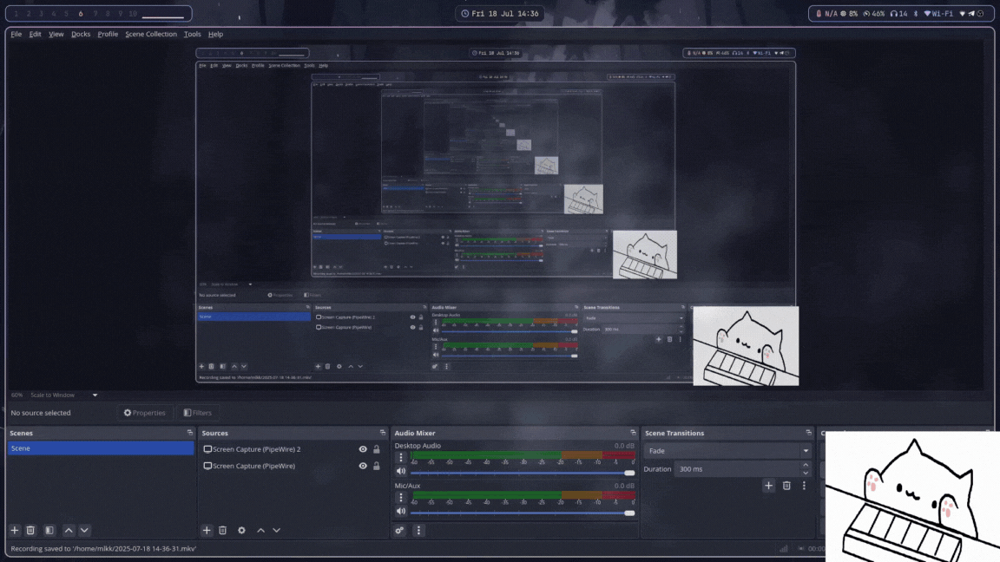

# BongoCat Keyboard Visualizer (Wayland, Linux)

A real-time animated Bongo Cat overlay that reacts to your keystrokes globally - typing along as you use your keyboard

Built for **Linux (Wayland)**, with direct keyboard event capturing via **libevdev**, and visuals rendered using **SDL2** + **SDL2_image**.

Expected to work on other Wayland compositors.



## 🔧 Requirements

- SDL2
- SDL2_image
- libevdev
- root access (for reading `/dev/input/event*` directly)

## 📦 Dependencies & Build

```bash
# Build with
gcc main.c -o bongocat $(pkg-config --cflags --libs sdl2 SDL2_image libevdev) -pthread
```

## 🚀 Running

```bash
sudo ./bongocat /dev/input/eventX
# Replace /dev/input/eventX with your actual keyboard input device
```

To find the correct event number:

```bash
sudo libinput list-devices
# or
cat /proc/bus/input/devices
```

## 🛑 Warnings

- This **must** be run as **sudo** to access raw keyboard input.

## ⚔️ Developer Notes

Core logic breakdown:

- Captures global keystates via `libevdev` in a background thread.
- Classifies keypresses as left half of keyboard/right half of keyboard/spacebar.
- Renders appropriate animation frame using SDL2 in a loop.
- Uses mutex locks to sync state between threads.
- Falls back to idle frame when no keys are pressed after timeout.

## 🧠 Why?

Because there is no working alternatives for Wayland...


